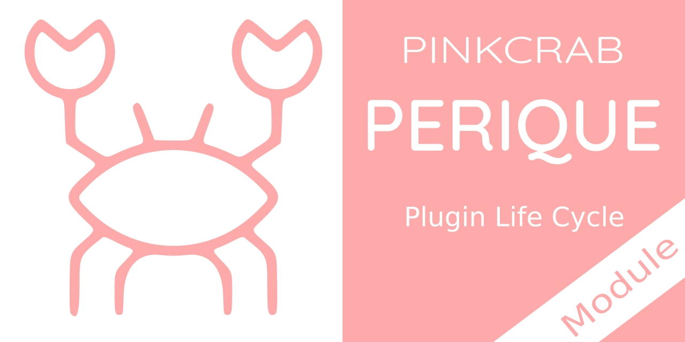

# Perique - Plugin Life Cycle 

A module for the PinkCrab Perique Framework which makes it easy to add subscribers which are triggered during various events within a plugins life cycle(Activation, Deactivation, Uninstall etc)

[](https://packagist.org/packages/pinkcrab/perique-plugin-lifecycle) [](https://packagist.org/packages/pinkcrab/perique-plugin-lifecycle) [](https://packagist.org/packages/pinkcrab/perique-plugin-lifecycle) [](https://packagist.org/packages/pinkcrab/perique-plugin-lifecycle) [](https://packagist.org/packages/pinkcrab/perique-plugin-lifecycle)


[![WordPress 5.9 Test Suite [PHP7.2-8.1]](https://github.com/Pink-Crab/Perique_Plugin_Life_Cycle/actions/workflows/WP_5_9.yaml/badge.svg)](https://github.com/Pink-Crab/Perique_Plugin_Life_Cycle/actions/workflows/WP_5_9.yaml)
[![WordPress 6.0 Test Suite [PHP7.2-8.1]](https://github.com/Pink-Crab/Perique_Plugin_Life_Cycle/actions/workflows/WP_6_0.yaml/badge.svg)](https://github.com/Pink-Crab/Perique_Plugin_Life_Cycle/actions/workflows/WP_6_0.yaml)
[![WordPress 6.1 Test Suite [PHP7.2-8.1]](https://github.com/Pink-Crab/Perique_Plugin_Life_Cycle/actions/workflows/WP_6_1.yaml/badge.svg)](https://github.com/Pink-Crab/Perique_Plugin_Life_Cycle/actions/workflows/WP_6_1.yaml)
[](https://codecov.io/gh/Pink-Crab/Perique_Plugin_Life_Cycle)
[](https://scrutinizer-ci.com/g/Pink-Crab/Perique_Plugin_Life_Cycle/?branch=master)
[](https://codeclimate.com/github/Pink-Crab/Perique_Plugin_Life_Cycle/maintainability)


> Requires  
> [Perique Plugin Framework 2.0.*](https://perique.info)  
> Wordpress 5.9+ (tested from WP5.9 to WP6.1)  
> PHP 7.4+ (tested from PHP7.4 to PHP8.1)  

****

## Why? ##

Makes for a simple OOP approach to handling WordPress Plugin Life Cycle events such as Activation, Deactivation and Uninstallation.

Connects to an existing instance of the Perique Plugin Framework to make use of the DI container and other shared services. (Please note due to the way these hooks are fired, you may not have full access to your DI Custom Rules, please read below for more details.)

****

## Setup ##

To install, you can use composer
```bash
$ composer require pinkcrab/perique-plugin-lifecycle
```

## Installing the Module

This must be bootstrapped with Perique to be used. This can easily be done on your main plugin file.

```php
// file ../wp-content/plugins/acme_plugin/plugin.php

// Boot the app as normal
$app = (new App_Factory())
    ->default_setup()
    ->module(
        Plugin_Life_Cycle::class, 
        fn(Plugin_Life_Cycle $module): Plugin_Life_Cycle => $module
            ->plugin_base_file(__FILE__)
            ->event(SomeEvent::class)
            ->event('Foo\Some_Class_Name')
    ->boot();
```

The `plugin_base_file()` must be supplied and it must match the entry point of your plugin.

All events can be passed as there calss name, should be full namespace, or as a string of the class name.

## Event Types ##

There are 3 events which you can write Listeners for. Each of these listeners will implement an interface which requires a single `run()` method.

### Activation

All classes must implement the `PinkCrab\Plugin_Lifecycle\State_Event\Activation` interface.

```php
class Create_Option_On_Activation implements Activation {
    public function run(): void{
        update_option('plugin_activated', true);
    }
}
```
> This would then be run whenever the plugin is activated

### Deactivation

All classes must implement the `PinkCrab\Plugin_Lifecycle\State_Event\Deactivation` interface.

> These events will fail silently when called, so if you wish to catch and handle any errors/exceptions, this should be done within the events run method.

```php
class Update_Option_On_Deactivation implements Deactivation {
    public function run(): void{
        try{
            update_option('plugin_activated', false);
        } catch( $th ){
            Something::send_some_error_email("Deactivation event 'FOO' threw exception during run()", $th->getMessage());
        }
    }
}
```
> This would then be run whenever the plugin is deactivated

### Uninstall

All classes must implement the `PinkCrab\Plugin_Lifecycle\State_Event\Uninstall` interface.

> As of 0.2.0, the Uninstall process has been improved, this will now allow the injection of dependencies as we no longer used the serialized callback held in `uninstall_plugins` held in options. 

> We automatically catch any exceptions and silently fail. If you wish to handle this differently, please catch them in your own code.


```php
class Delete_Option_On_Uninstall implements Uninstall {
    public function run(): void{
        try{
            delete_option('plugin_activated');
        } catch( $th ){
            // Do something rather than let it be silently caught above!
        }
    }
}
```
> This would then be run whenever the plugin is uninstalled

## Change Log ##
* 1.0.0 - Updated for Perique V2 and implements the new Module system.
* 0.2.1 - Updated dev dependencies and GH pipeline.
* 0.2.0 - Improved the handling of Uninstall events and updated all dev dependencies.
* 0.1.1 - Added get_app() to main controller
* 0.1.0 - Inital version
